<!-- Profile README: all repositories are linked below. -->
<picture>
  <source media="(prefers-color-scheme: dark)" srcset="./dark.svg">
  <source media="(prefers-color-scheme: light)" srcset="./light.svg">
  
</picture>

<h1 align="center">Pratham Chawda</h1>

<strong>Cybersecurity • Software Development • Information Technology</strong> B.Tech IT student at Amity University Rajasthan

---

## About me

I'm an Information Technology student interested in cybersecurity, ethical hacking fundamentals, networking, and software development. I learn by building practical tools, experimenting with code, and documenting projects.

- 🛡️ **Security:** Linux, Nmap, network scanning, secure file handling
- 💻 **Programming:** Python, C, C++, Java, JavaScript
- 🌐 **Web:** HTML, CSS, React, Next.js, Node.js, Express, REST APIs
- 🗄️ **Data:** PostgreSQL, MySQL, MongoDB, Pandas, NumPy
- 🔌 **Hardware:** Arduino Uno, ESP32-CAM
- 🎓 **Education:** B.Tech Information Technology, Amity University Rajasthan

## All my repositories

I’ve included every repository currently listed on my GitHub account. Click a card to open the repository. Cards load from GitHub Readme Stats; if that service is unavailable, use the repository links in the index below.

<table>
<tr><td width="50%" valign="top"> <strong><a href="https://github.com/prath-amChawda/muon-tomography">Muon Tomography</a></strong> Python simulation and interactive Three.js visualization for muon scattering tomography.</td><td width="50%" valign="top"> <strong><a href="https://github.com/prath-amChawda/Network-Scanner-using-python">Network Scanner</a></strong> ARP-based device discovery and open-port checks using Python.</td></tr>
<tr><td width="50%" valign="top"> <strong><a href="https://github.com/prath-amChawda/Secure-File-Transfer-project">Secure File Transfer</a></strong> GUI file encryption/decryption using Fernet and generated keys.</td><td width="50%" valign="top"> <strong><a href="https://github.com/prath-amChawda/cyber-security">Cybersecurity</a></strong> Cybersecurity learning and project repository.</td></tr>
<tr><td width="50%" valign="top"> <strong><a href="https://github.com/prath-amChawda/CODING-SAMURAI-INTERNSHIP-TASK">Coding Samurai Internship</a></strong> Python tasks including file handling, CSV/JSON, scraping and automation.</td><td width="50%" valign="top"> <strong><a href="https://github.com/prath-amChawda/arduino-projects">Arduino Projects</a></strong> Arduino and embedded programming repository.</td></tr>
<tr><td width="50%" valign="top"> <strong><a href="https://github.com/prath-amChawda/python">Python</a></strong> Python code and practice.</td><td width="50%" valign="top"> <strong><a href="https://github.com/prath-amChawda/Cpp">C++</a></strong> C++ code and practice.</td></tr>
<tr><td width="50%" valign="top"> <strong><a href="https://github.com/prath-amChawda/C">C</a></strong> C programming repository.</td><td width="50%" valign="top"> <strong><a href="https://github.com/prath-amChawda/html">HTML</a></strong> HTML examples and code.</td></tr>
<tr><td width="50%" valign="top"> <strong><a href="https://github.com/prath-amChawda/aws">AWS</a></strong> AWS learning repository.</td><td width="50%" valign="top"> <strong><a href="https://github.com/prath-amChawda/web-dev-project">Web Development</a></strong> Repository currently has no files.</td></tr>
<tr><td width="50%" valign="top"> <strong><a href="https://github.com/prath-amChawda/prath-amChawda">Profile Repository</a></strong> Profile README and theme-aware banner assets.</td><td></td></tr>

</table>

### Repository index

| Repository | Project / contents |
|---|---|
| [muon-tomography](https://github.com/prath-amChawda/muon-tomography) | Muon tomography simulation and 3D dashboard |
| [Network-Scanner-using-python](https://github.com/prath-amChawda/Network-Scanner-using-python) | ARP-based network discovery and port checks |
| [Secure-File-Transfer-project](https://github.com/prath-amChawda/Secure-File-Transfer-project) | GUI file encryption/decryption with Fernet |
| [cyber-security](https://github.com/prath-amChawda/cyber-security) | Cybersecurity learning and project collection |
| [CODING-SAMURAI-INTERNSHIP-TASK](https://github.com/prath-amChawda/CODING-SAMURAI-INTERNSHIP-TASK) | Python internship tasks and automation |
| [arduino-projects](https://github.com/prath-amChawda/arduino-projects) | Arduino projects |
| [python](https://github.com/prath-amChawda/python) | Python code and practice |
| [Cpp](https://github.com/prath-amChawda/Cpp) | C++ code and practice |
| [C](https://github.com/prath-amChawda/C) | C programming |
| [html](https://github.com/prath-amChawda/html) | HTML examples |
| [aws](https://github.com/prath-amChawda/aws) | AWS learning repository |
| [web-dev-project](https://github.com/prath-amChawda/web-dev-project) | Web development repository; currently empty |
| [prath-amChawda](https://github.com/prath-amChawda/prath-amChawda) | Profile README and banner assets |

## Technologies

## Certifications

- Complete Ethical Hacking Course — Udemy
- Introduction to Cyber Security — Cisco

## Connect

- [GitHub — @prath-amChawda](https://github.com/prath-amChawda)
- [LinkedIn — Pratham Chawda](https://www.linkedin.com/in/pratham-chawda-54853527a)
- [Email — chawdapratham31@gmail.com](mailto:chawdapratham31@gmail.com)

---

Learning in public • Building practical projects • Exploring cybersecurity

